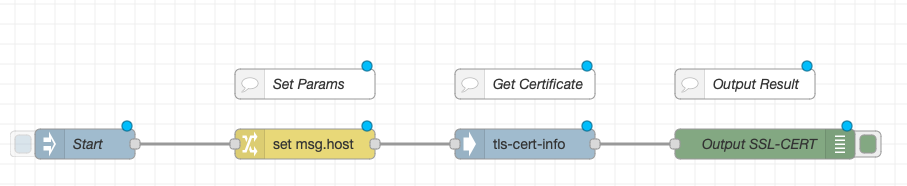

# node-red-tls-cert-info

A Node-RED node that retrieves SSL/TLS certificate information from a given host and port.

## Installation

To install this node, run the following command in your Node-RED user directory:

npm install @cappern/node-red-tls-cert-info


## Usage

The `tls-cert-info` node retrieves the SSL/TLS certificate information from the given host and port. The certificate details are returned in the `payload` object of the message.

### Inputs

| Property | Type    | Required | Description                                     |
| -------- | ------- | -------- | ----------------------------------------------- |
| host     | string  | yes      | Hostname to connect to.                          |
| port     | integer | no       | Port number to connect to (default is `443`).    |
| payload  | string  | yes      | The payload of the message to publish.           |

### Outputs

| Property | Type   | Description                                 |
| -------- | ------ | ------------------------------------------- |
| payload  | object | Object containing the certificate details.  |

The `payload` object has the following properties:

| Property      | Type    | Description                                                                      |
| ------------- | ------- | -------------------------------------------------------------------------------- |
| subject       | object  | Object containing the details of the subject of the certificate.                |
| keysize       | integer | The size of the key used in the certificate.                                    |
| serialnumber  | string  | The serial number of the certificate.                                           |
| validFrom     | string  | The date and time when the certificate becomes valid.                           |
| validTo       | string  | The date and time when the certificate expires.                                 |
| san           | string  | A list of Subject Alternative Names (SANs) present in the certificate.          |
| pem           | string  | The PEM-formatted certificate.                                                  |


The `hostname` and `port` values can be configured in the node's configuration or set by `msg.host` and `msg.port`, respectively.

### Example Flow

Here is an example flow that retrieves the SSL/TLS certificate information from `www.ferrari.com` and outputs it to the debug console:



```json
[{"id":"d9458ee26e50ecd5","type":"inject","z":"d2e014450d0e3a4b","name":"Start","props":[{"p":"payload"},{"p":"topic","vt":"str"}],"repeat":"","crontab":"","once":false,"onceDelay":0.1,"topic":"","payload":"","payloadType":"date","x":150,"y":220,"wires":[["50d9be476b07daeb"]]},{"id":"3023f57f560d34c4","type":"debug","z":"d2e014450d0e3a4b","name":"Output SSL-CERT","active":true,"tosidebar":true,"console":false,"tostatus":false,"complete":"payload","targetType":"msg","statusVal":"","statusType":"auto","x":830,"y":220,"wires":[]},{"id":"50d9be476b07daeb","type":"change","z":"d2e014450d0e3a4b","name":"","rules":[{"t":"set","p":"host","pt":"msg","to":"www.ferrari.com","tot":"str"}],"action":"","property":"","from":"","to":"","reg":false,"x":370,"y":220,"wires":[["481470c97bd45b0d"]]},{"id":"5590eabc990e75f9","type":"comment","z":"d2e014450d0e3a4b","name":"Set Params","info":"","x":370,"y":160,"wires":[]},{"id":"a2090b54dbf45c3e","type":"comment","z":"d2e014450d0e3a4b","name":"Get Certificate","info":"","x":590,"y":160,"wires":[]},{"id":"22f6d42603cf75ed","type":"comment","z":"d2e014450d0e3a4b","name":"Output Result","info":"","x":810,"y":160,"wires":[]},{"id":"481470c97bd45b0d","type":"tls-cert-info","z":"d2e014450d0e3a4b","name":"","x":590,"y":220,"wires":[["3023f57f560d34c4"]]}]
```

## References

- [Node-RED](https://nodered.org/)
- [SSL/TLS](https://en.wikipedia.org/wiki/Transport_Layer_Security)

## License

This project is licensed under the MIT License - see the [LICENSE](LICENSE) file for details.
